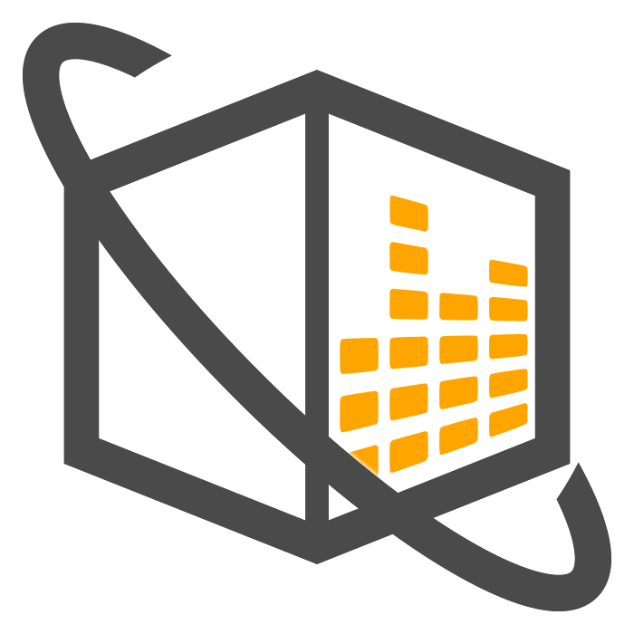

# メディアキット

メディア関係者の皆さまへ

音箱 -OTOBAKO- に関する素材データとなります。ご自由にお使いください。

## ロゴ


## アイコン

|  透過  |  メッシュ  |
| ---- | ---- |
|    |    |

## スクリーンショット


## コンセプト

世界につながるレッスンスタジオ  
音箱 -OTOBAKO- は音楽専門のオンラインレッスンプラットフォームです。

```
音を楽しむことに技術はいらないけれど、
うまくできたらきっともっと楽しくなる。

うまくできるようになったら、今度は誰かに教えたい。

音楽でつながり、音楽が広がる。
そんな場所を作りたいという想いから音箱は始まりました。
```

## フライヤー

### 講師向け

|  表  |  裏  |
| ---- | ---- |
|    |    |
